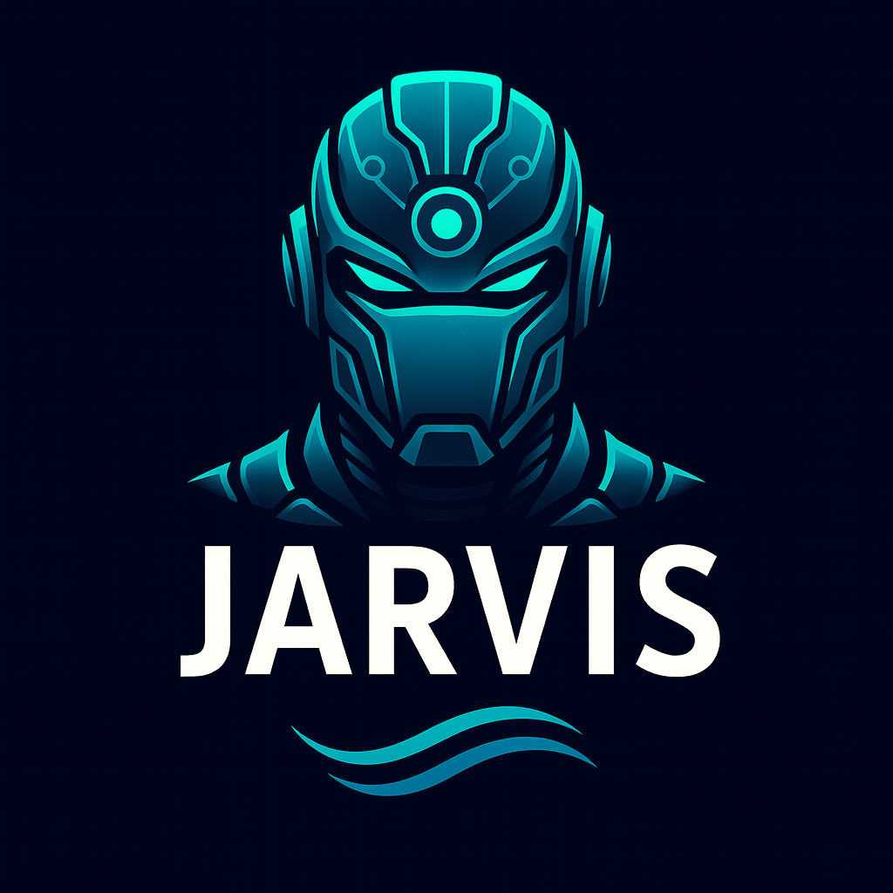

<div align="center">
  
</div>

# Jarvis

> Your local AI assistant for Rust, Linux, and Homelab operations

**Jarvis** is your all-in-one CLI-native AI companion built in Rust. It’s not just for coding — it’s your daily system copilot for development, DevOps, and homelab workflows. Designed for power users who run Arch, deploy to Proxmox, and live in the terminal.

## 🔧 Key Features

* 🧠 **Developer Copilot**

  * Write, refactor, and fix Rust, Zig, Shell scripts
  * Aware of Git, dependencies, and build failures
  * Integrates with `nvim` and LSP tooling

* 🛠 **DevOps + Infra Brain**

  * Systemctl, Btrfs, Docker, Snapper, KVM automation
  * Proxmox, DNS, VPN, and homelab task orchestration
  * Cloud-aware: Azure, AWS, GCP integration (via plugins)

* 🖥 **Arch & Linux System Companion**

  * Manages Snapper, Btrfs snapshots, pacman, AUR helpers
  * Aware of your dotfiles and user environment
  * Supports advanced kernel configurations

* 🤖 **LLM-Driven Workflows**

  * Local LLM (Ollama, Claude, GPT) integration
  * Plugin model for Claude Code, OpenAI, and custom models
  * Uses a local memory DB to store context + task history

## 🚀 Goals

* [ ] CLI interface for natural language task execution
* [ ] Smart tool routing and fallback (ghostctl/zion-style)
* [ ] Dotfile-aware LLM shell
* [ ] Plugin SDK for extending with new tools/services
* [ ] Secure sandboxing and offline inference options

## 📦 Example Commands

```sh
jarvis explain my snapper timeline
jarvis diagnose my nginx reverse proxy
jarvis write a Rust CLI with clap and serde
jarvis check btrfs mount status
jarvis fix my docker-compose error
```

## 🧱 Architecture

* `jarvis-core` — CLI + LLM engine
* `jarvis-agent` — Plugin runner, command router
* `jarvis-shell` — User environment detection, dotfile hooks
* `jarvis.toml` — Config for preferences, paths, package manager, LLM backend

## 🔐 Privacy-First Design

* Local Ollama/GGUF or Claude via proxy
* No telemetry, no cloud required
* Works fully offline once configured

## 🧠 Vision

Jarvis isn’t just ChatGPT in your terminal — it’s:

* Your system-aware Linux and Arch companion
* Your home infra assistant for Proxmox and services
* Your dev helper for code, scripts, debugging, and builds
* Your CLI-native AI layer

All local. All scriptable. All yours.

---

MIT Licensed — Powered by Rust ⚙️ + AI 🔮

